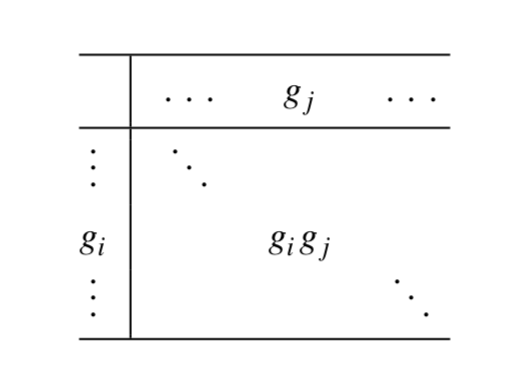

# Apunte del curso _Teoría de Grupos para Físicos_
Este apunte está basado en el libro _Group Theory in a Nutshell for Physicists_ de _A. Zee_
_por Tomás Rojas_

## Simetría y Grupos

Intuitivamente todos sabemos que un polígono regular de $n$ lados es menos simétrico que uno de $n+1$ y todos son menos simétricos que un círculo, que es básicamente un polígono regular con $n \to \infty$

### Simetría en física
En física nos interesan las simetrías presentes en las leyes fundamentales de la física.

Consideremos un conjunto de transformaciones que dejan las leyes de la física invariantes (simetrías) $\{T_1, T_2, ...\}$. Primero apliquemos la transformación $T_j$ y luego la transformación $T_i$. La transformación que resulta de la secuencia de dos transformaciones se denota por el "producto" $T_i \cdot T_j$ que por supuesto también deja las leyes de la física invariantes.

En este ejemplo pusimos el índice de las transformaciones $i$ como un índice discreto, pero en principio también puede ser continuo. De hecho, una transformación puede depender de varios parámetros continuos. El ejemplo clásico es la rotación $R(\theta, \varphi, \zeta)$, que puede ser completamente caracterizada por tres ángulos, como se indica. Por ejemplo, en una parametrización estándar, los dos ángulos $\theta$ y $\varphi$ especifican el vector unitario que nos da el eje de rotación, mientras que el ángulo $\zeta$ especifíca el ángulo de rotación al rededor de ese eje.

### Grupos

Un grupo $G$ consiste de un conjunto de entidades $\{g_\alpha\}$ llamadas elementos del grupo, estos elementos pueden componerse entre ellos (coloquialmente "se pueden multiplicar entre ellos"). Dados dos elementos cualesquiera $g_\alpha$ y $g_\beta$, el producto $g_\alpha \cdot g_\beta$ es igual a otro elemento, $g_\gamma$ que también pertenece a $G$. Esta propiedad es la _clausura_. La composición o multiplicación se indica por un punto. El conjunto de todas las relaciones de la forma $g_\alpha \cdot g_\beta = g_\gamma$ se llama la tabla de multiplicación del grupo.

La composición o multiplicación, cumple los siguientes axiomas:

  1. Asociatividad: $(g_\alpha \cdot g_\beta) \cdot g_\gamma = g_\alpha \cdot (g_\beta \cdot g_\gamma)$
  2. Existencia de la identidad: Existe un elemento del grupo, llamado identidad y denotado por $I$, que cumple $I \cdot g_\alpha = g_\alpha$ y $g_\alpha \cdot I = g_\alpha$
  3. Existencia del inverso: Para cada elemento del grupo $g_\alpha$ existe un único elemento del grupo, llamado _inverso de $g_\alpha$_ y denotado por $g_\alpha^{-1}$, tal que $g_\alpha \cdot g_\alpha^{-1} = I$ y $g_\alpha^{-1} \cdot g_\alpha = I$.

Algunos comentarios se desprenden de esto:

  1. La composición no es necesariamente conmutativa. En general, $g_\alpha \cdot g_\beta$ no es lo mismo que $g_\beta \cdot g_\alpha$ podemos verlo en general como la multiplicación de matrices. Un grupo para el cual la regla de composición es conmutativa se llama _abeliano_, y grupos en los que no... _no abeliano_
  2. La inversa por la izquierda y por la dereha son por definición la misma. Podemos crear estructuras matemáticas donde esto no es cierto, pero estas estructuras no son grupos.
  3. Es convencional denotar $I$ con $g_0$.
  4. La etiqueta $\alpha$ que distingue el elemento del grupo $g_\alpha$ puede ser continua o discreta.
  5. El conjunto de elementos de un grupo puede ser finito, en cuyo caso $G$ es un grupo de $n$ elementos. ($n$ es conocido como el óden del grupo)

Físicamente podemos pensar la composición como transformaciones, donde el que un elemento tenga inversa, en el contexto de la física, significa que lo que sea que haya hecho esa transformación, puede ser deshecho.

### Ejemplos de Grupos

Para entender mejor lo que es un grupo, es bueno ver ejemplos. Para cada uno de los siguientes ejemplos hay que verificar (quizá lo haga, quizá no) que se cumplen los axiomas de los grupos.

  1. Roteciones en espacio euclidiano de 3 dimensiones, como ya fue mencionado, forman un grupo muy importante en física. Piensen en esto como rotar un objeto rígido como un busto de Newton. Después de dos rotaciones en sucesión, solo tenemos una orientación distnta, el busto no ha sido deformado. Así la sucesión de dos rotaciones es otra rotación.
     + Las rotaciones no conmutan.
     + Descartes pensó que el espacio euclideano tridimensional puede ser representado como un espacio vectorial lineal, donde las coordenadas son dadas por la ayuda de tres vectores base unitarios $\vec{e}_x = \left(\begin{smallmatrix}1\\0\\0\end{smallmatrix}\right)$, $\vec{e}_y = \left(\begin{smallmatrix}0\\1\\0\end{smallmatrix}\right)$ y $\vec{e}_z = \left(\begin{smallmatrix}0\\0\\1\end{smallmatrix}\right)$ alineados en tres direcciones ortogonales tradicionalmente llamadas $x, y$ y $z$. Una rotación toma cada vector base y lo pasa a una combinación lineal de estos tres vectores base, por lo que una rotación se representa con una matríz de 3 por 3. Este grupo de rotaciones se llama $SO(3)$. El determinante de una rotación es igual a 1 (esto significa que no deforma el espacio y que el volumen se conserva).

  2. Rotaciones en espacio euclideano bidimensional, esto es un plano, forman el grupo $SO(2)$, que consiste en un conjunto de rotaciones al rededor de un ángulo perpendicular al plano. Denotemos una rotación en un ángulo $\phi$ como $R(\phi)$. Así $R(\phi_1)R(\phi_2) = R(\phi_1 + \phi_2) = R(\phi_2)R(\phi_1)$. Estas rotaciones si conmutan.
  3. El grupo de permutaciones $S_4$ reordena un conjunto ordenado de cuatro objetos, que podemos nombrar de manera arbitraria, por ejemplo, $(A,B,C,D)$ 0 $(1,2,3,4)$. Un ejemplo es que tomemos una permutación tal que $1\to3,2\to4,3\to2,4\to1$. Es bien sabido que hay $4! = 24$ de estas permutaciones, por lo que 24 es la cantidad de elementos de este grupo. De igual manera para el grupo $S_n$ hay $n!$ elementos y son las permutaciones de conjuntos ordenados de tamaño $n$.
  4. Permutaciones pares del grupo $A_4$. También es bien conocido, una permutación puede ser par o impar. La mitad de las permutaciones en $S_4$ son pares, y la otra mitad es impar. Así $A_4$ tiene 12 elementos. A viene de _alternando_.
  5. Las dos raíces cuadradas de 1, $\{1, -1\}$, del grupo $Z_2$ bajo multiplicaciones ordinarias.
  6. De manera similar las tres raíces cúbicas de 1 forman el grupo $Z_3=\{1,\omega, \omega^2\}$ con $\omega \equiv e^{2\pi i/3}$. De inmediato vemos $Z_4={1,i,-1,-i}$, de donde se desprende $i=e^{i\pi/2}$. De manera más general, las $N$ raíces N-ésimas de 1 forman el grupo $Z_N=\{e^{i2\pi j/N}:j=0,...,N-1\}$. La composición está definida por la multiplicación de elementos del grupo.
  7. Números complejos de magnitud 1, esto es $e^{i\phi}$, forma un grupo llamado $U(1)$, con $e^{i\phi_1}e^{i\phi_2}=e^{i(\phi_1+\phi_2)}$. Como $e^{i(\phi+2\pi)}=e^{i\phi}$, podemos restringir $\phi$ en el rango de 0 a $2\pi$. De manera física, podemos pensar este grupo como el límite en el continuo de $Z_N$ con $e^{i2\pi j /N}\to e^{i\phi}$ en el límite $N\to\infty$ y $j\to\infty$ con $\phi = 2\pi j/N$.
  8. La adición de $\text{entero} \mod N$ (operación de un _entero módulo N_) generan un grupo. Por ejemplo, bajo adición $\mod 5$, el conjunto $\{0,1,2,3,4\}$, forma un grupo: $2+1=3,3+2=0,4+3=2$, y así. La composición de los elementos del grupo está definida por $j\cdot k = (j + k) \mod 5$. El elemento identidad está denotado por 0. El inverso de 2, por ejemplo, es 3, de 4 es 1, y así. Claramente este grupo es abeliano.
  9. La adición de números reales forma un grupo. Los elementos del grupo se llaman números reales $u$ y la composición es $u \cdot v \equiv u + v$, el símbolo $+$ es lo que coloquialmente llamamos _sumar_. Se puede verificar que los axiomas se cumplen. El elemento identidad está denotado por 0, y el inverso de un elemento $u$ es el elemento $-u$.
  10. El grupo aditivo de enteros se obtiene del grupo aditivo de los reales restringiendo $u$ y $v$ del ejemplo anterior a solo los enteros positivos y negativos.
  11. Como muchos sabrán, en la teoría de relatividad especial del tío Alberto, las coordenadas de espacio-tiempo usadas por dos observadores en movimiento relativo con velocidad $v$ a lo largo del eje en la dirección $x$ (como ejemplo), están relacionadas por las transformaciones de Lorentz (con $c$ la velocidad de la luz):
        - $ct' = \cosh(\varphi) ct + \sinh(\varphi)x$
        - $x' = \sinh(\varphi) ct + \cosh(\varphi)x$
        - $y'=y$
        - $z'=z$

      donde el ángulo $\varphi$ está determinado por
      $\tanh\varphi=v$ (en otras palabras, $\cosh\varphi=1/\sqrt{1-\frac{v^2}{c^2}}$ y $\sinh\varphi=\frac{v}{c}/\sqrt{1-\frac{v^2}{c^2}}$). Eliminando las variables $y$ y $z$ podemos escribir la transformación de Lorentz como:

      $$
      \begin{pmatrix}
      ct' \\ x'
      \end{pmatrix}
      =
      \begin{pmatrix}
      \cosh{\varphi} & \sinh{\varphi} \\
      \sinh{\varphi} & \cosh{\varphi}
      \end{pmatrix}
      \begin{pmatrix}
      ct \\ x
      \end{pmatrix}
      $$
      Físicamente, supongamos que un tercer observador se mueve a una velocidad definida por el ángilo $\varphi_2$ relativo al observador que se mueve a la velocidad definida por el ángulo $\varphi_1$ relativo al primer observador. Entonces esperamos que el tercer observador se mueva a una velocidad determinada por $\varphi_1$ y $\varphi_2$ relativo al primer observador. (Todo esto solo en una dimensión.) Este enunciado físico se expresa matemáticamente con que las transformaciones de Lorentz forman un grupo:
      $$
      \begin{pmatrix}
      \cosh{\varphi_2} & \sinh{\varphi_2} \\
      \sinh{\varphi_2} & \cosh{\varphi_2}
      \end{pmatrix}
      \begin{pmatrix}
      \cosh{\varphi_1} & \sinh{\varphi_1} \\
      \sinh{\varphi_1} & \cosh{\varphi_1}
      \end{pmatrix}
      =
      \begin{pmatrix}
      \cosh{(\varphi_1 +\varphi_2)} & \sinh{(\varphi_1 +\varphi_2)} \\
      \sinh{(\varphi_1 +\varphi_2)} & \cosh{(\varphi_1 +\varphi_2)}
      \end{pmatrix}
      $$
  12. Consideremos un conjunto de matrices de $n$ por $n$ $M$ con determinantes iguales a 1. Éstas forman un grupo bajo multiplicaciones de matrices, ya que $\det{(M_1M_2)=\det(M_1)\det(M_2)}$. Así si ambos son 1, la clausura se mantiene y como el determinante es $1\neq 0$ tiene inversa. Este grupo se conoce como $SL(n, R)$, el _special linear group_ con entradas reales. Si se permiten números complejos, se llama $SL(n, C)$. (las matrices con determinante unitario se llaman _especiales_)

### Concepto de subgrupo
Dado un conjunto de entidades $\{g_\alpha\}$ del grupo $G$, si hay un subconjunto $\{h_\beta\}$ que forman un grupo $H$, entonces $H$ es un subgrupo de $G$. Algunos ejemplos:
  1. $SO(2)\subset SO(3)$ en este caso notemos que el índice $\alpha$ en $\{g_\alpha\}$ consiste de 3 ángulos, mientras que el índice $\beta$ en $\{h_\beta\}$ es solo un ángulo.
  2. $S_m\subset S_n, \quad \forall m<n$. Permutar tres objetos es lo mismo que permutar cinco pero dejar dos sin tocar.
  3. $A_n \subset S_n$
  4. $Z_2 \subset Z_4$ pero $Z_2 \not\subset Z_5$
  5. $SO(3) \subset SL(3,R)$

### Subgrupos cíclicos

Para un grupo finito $G$, elija algún elemento $g$ y multiplíquelo por sí mismo. En otras palabras, considere la secuencia $\{g, g^2=gg,...\}$. Mientras el producto no sea igual a la identidad, podemos seguir haciéndo esto. Como $G$ es finito, la secuencia tiene que terminar en algún punto con $g^k=I$. El conjunto de elementos $\{I, g, g^2,...,g^{k-1}\}$ forma un subrupo $Z_k$. Así, cualquier conjunto finito de elementos tiene un montón de subgrupos cíclicos. Si $k$ es igual el número de elementos en $G$, entonces el grupo $G$ es $Z_k$.

### Teorema de Lagrange
Lagrange provó el siguiente teorema. Sea un grupo $G$ con $n$ elementos, sea $H$ un subconjunto de $G$ con $m$ elementos. Entonces $m$ es un factor de $n$. O dicho de otra manera, $n/m$ es un entero.

La prueba sigue así. Liste un elementos de $H:\{h_1,h_2,...,h_m\}$. (Notar que como $H$ es un subgrupo, tiene que contener $I$). Sea $g_1\in G$ pero $\not\in H$. Considere ahora la lista $\{h_1g_1,h_2g_1,...,h_mg_1\} \equiv \{h_1,h_2,...,h_m\}g_1$. Note que este conjunto de elementos no forma un grupo ya que si lo formara, $g_1$ ya estaría en $H$ para poder mantener la clausura.

 Se asevera que los elementos de la lista recién presentada son todos distintos. Prueba por contradicción: Para $a\neq b, h_ag_1=h_bg_1\implies h_a=h_b$ multiplicando por la derecha por el inverso de $g_1$ ya que tiene inverso pues pertenece a $G$ que es un grupo.

 También se asevera que ninguno de los elementos de la lista mencionada está en $\{h_1,h_2,...,h_m\}$. Prueba: Para algún $a$ y $b$, $h_ag_1=h_b \implies g_1=h_a^{-1}h_b$, que contradice la asumción de que $g_1$ no está en $H$

 Ahora tomemos un elemento $g_2\in G$ que no haya estado en las dos listas previas, y formemos $\{h_1g_2,h_2g_2,...,h_mg_2\}\equiv\{h_1,h_2,...,h_m\}g_2$.

Se afirma   que todos los elementos de este nuevo grupo son distintos entre sí, esto es análogo a la muestra con $g_1$.

Repetimos este proceso. Después de cada paso, nos preguntamos si hay algún elemento en $G$ que no esté en las listas ya construidas. Si es así, seguimos con el proceso, eventualmente agotando los elementos de $G$. Hemos construido k listas, incluyendo la lista original $\{h_1,h_2,...,h_m\}$, así tenemos las listas $\{h_1,h_2,...,h_m\}g_j$ con $j=0,1,2,...,k-1$ (con $I=g_0$).

Así $n=mk$, esto es, $m$ es factor de $n$. QED.

### Producto directo entre Grupos

Dados dos grupos $F$ y $G$ (que pueden ser continuos o discretos), fuyos elementos están denotados por $f$ y $g$ respectivamente, podemos definir otro grupo $H=F\bigotimes G$, conocido como el producto directo entre $F$ y $G$, consistente de los elementos $(f, g)$.El producto entre dos elementos $(f,g)$ y $(f',g')$ de $H$ está dado por $(f,g)(f',g')=(ff',gg')$. El elemento identidad de $H$ está dado por $(I,I)$.

¿Cuál es el inverso de $(f,g)$? Si $F$ y $G$ tienen $m$ y $n$ elementos respectivamente, ¿cuántos elementos tiene $F\bigotimes G$?

El inverso de $(f,g)$ es $(f^{-1},g^{-1})$ y $F\bigotimes G$ tiene $mn$ elementos.

### Vierergruppe $V$ de Klein

Un ejemplo simple está dado por $Z_2\bigotimes Z_2$ (recordar que el grupo $Z_i$ es el grupo que contiene a todas las raíces $i$-ésimas de 1), que consiste de cuatro elementos: $I=(1,1), A=(-1,1), B=(1,-1), C=(-1,-1)$- Por ejemplo, tenemos $AB=(-1,-1)=C$. Notar que este grupo es distinto al grupo $Z_4$ que consiste de $1,-1,i,-i$. El cuadrado de cualquier elemento de $Z_2\bigotimes Z_2$ es la identidas, esto no pasa en $Z_4$.

Incidentalmente, $Z_2\bigotimes Z_2$, también conocido como el Vierergruppe $V$ de Klein ("4-grupo" en alemán) y denotado por $V$ jugó un rol importante en el programa de Klein.

Notar que los elementos de F, vistos como un subgrupo de $F\bigotimes G$, se pueden escribir como $(f,I)$. de la misma manera los elementos de $G$ se escriben como $(I,g)$. Claramente estos elementos conmutan.

El producto directo se ve como un método "barato" de construir grupos más grandes a partir de grupos más pequeños, pero parece ser que la naturaleza usa esta posibilidad. La teoría de las interacciónes fuertes, débiles y electromagnéticas, está basada en el grupo $SU(3)\bigotimes SU(2) \bigotimes U(1)$.

### tabla de multiplicar
Un grupo finito con $n$ elementos puede ser caracterizado por su tabla de multiplicar. construimos una tabla de $n$ por $n$, escribiendo el producto $g_ig_j$ en la fila $i$ y columna $j$:

en las filas y en las columnas, cada elemento puede aparecer solo una vez. Se puede vislumbrar lo tedioso que puede ser formar estas tablas.

### Una manera rápida: construir los subgrupos ciclicos

vamos a usar la observación que en un grupo finito, si seguimos multiplicando por un elemento, vamos a llegar a la identidad.

Dado un grupo $G$ de 4 elementos $\{I,A,B,C\}$, multiplicamos $A$ por si mismo. Si $A^4=I$, entonces $G=Z_4$. Por el teorema de Lagrange, $A^3=I$ no está permitido. Si $A^2=I$, luego multiplicamos $B$ por si mismo. O bien $B^2=I$ o bien $B^4=I$. La última opción no es viable, por lo cual $B^2=I$, y $AB=BA=C$. Entonces $G=Z_2\bigotimes Z_2$, con los cuatro elementos representados por $(1,1),(1,-1),(-1,1),(-1,-1)$

### Representaciones
para grupos grandes, escribir una tabla de multiplicar no tiene sentido. En vez de eso, los grupos finitos se definen por sus propiedades, como en el ejemplo de arriba, o por sus representaciones, que enlistan los elementos (algunas veces llamados generadores) desde los cuales todos los otro elementos pueden ser obtenidos por multiplicaciones de grupos, y la relación fundamental que los generadores satisfacen. Así, los grupos $Z_4$ y $Z_2\bigotimes Z_2$ son definidos por sus representaciones como sigue:

$$
Z_4:\left<A|A^4=I\right>\\
Z_2\bigotimes Z_2:\left<A,B|A^2=B^2=I,AB=BA\right>
$$

Los dos grupos son claramente diferentes. En particular, $Z_4$ tiene solo un elemento que al cuadrado es $I$, llamado $A^2$.

### Homomorfismos e isomorfismos

Un mapeo $f:G\to G'$ de un grupo $G$ a un grupo $G'$ se llama homomorfismo si preserva la estructura multiplicativa de $G$, esto es, si $f(g_1)f(g_2)=f(g_1g_2)$. Este requerimiento implica que $F(I)=I$. Un homomorfismo pasa a ser in isomorfismo si el mapeo es uno-a-uno y completa.

Ahora podemos decir que el grupo aditivo de los enteros $\mod N$ es isomorfico a $Z_n$.

Para un ejemplo interesante, consideremos $Z_2\bigotimes Z_4$. Usamos la notación aditiva aqui y escribimos los elementos$(n,m)$ y los componemos como $(n,m)\cdot (n',m')=(n+n' \mod 2, m+m' \mod 4)$.
Empezamos con $(0,0)$ y le sumamos $(1,1)$ de manera repetida:$(0,0)\to^{+(1,1)}(1,1)\to(0,2)\to(1,3)\to(o,4)=(0,0)$; hemos vuelto a donde empezamos. Ahora vamos a empezar con $(0,1)$ y sumsmos $(1,1)$ de manera repetida: $(0,1)\to^{+(1,1)}(1,2)\to(0,3)\to(1,0)\to(0,1)$. Hemos vuelto a donde empezamos. Por lo que podemos visualizar $Z_2\bigotimes Z_4$ como una grilla discreta en un toro.

Ahora consideremos $Z_2\bigotimes Z_3$ formado por los elementos $(n,m)$, que están compuestos por $(n+n' \mod 2, m+m`\mod 3)$. Empezamos nuevamente con $(0,0)$ y sumamos repetidamente $(1,1)$: $(0,0)\to^{+(1,1)}(1,1)\to(2,2)=(0,2)\to(1,3)=(1,0)\to(2,1)=(0,1)\to(1,2)\to(2,3)=(0,0)$ Hemos vuelto donde empezamos. En el proceso recorrimos los seis elementos de este grupo. Así concluimos que los elementos $(0,0),(1, 1), (0, 2), (1, 0), (0, 1),(1,2)$ describe $Z_6$.

Por lo tanto, $Z_2\bigotimes Z_3$ y $Z_6$ son isomorfos; son literalmente el mismo grupo. Notar que este fenómeno de posible isomorfismo etre $Z_p\bigotimes Z_q$ y $Z_{pq}$, no requiere que $p$ y $q$ sean primos, solo que sean primos relativos, como lo es por ejemplo $Z_4 \bigotimes Z_9$.

Otro ejemplo de isomorfismo, el grupo $SO(2)$ y $U(1)$ introducidos anteriormente, son isomorfos. El mapeo $f:SO(2)\to U(1)$ está definido simplemente como $f(R(\phi))=e^{i\phi}$.

## Grupos finitos

### Grupos de permutación y teorema de Cayley

El grupo de permutación $S_n$ y su subrupo natural $A_n$ son como los grupos estrella de la teoría de grupos ya que son buenos ejemplos. Todos sabemos como funcionan las permutaciones.

Un teorema debido a Cayley afirma que un grupo finito $G$ con $n$ elementos es isomorfo (es to es, idéntico) a un subgrupo de $S_n$.

La lista de $n$ elementos de $G$ que es $\{g_1,g_2,...,g_n\}$ en el odren perteneciente a la fila en la tabla de multimplicación que le corresponde al elemento identidd. Así en la fila del elemento $g_i$ tenemos, en orden $\{g_ig_1,g_ig_2,...,g_ig_n\}$. Esto corresponde a una permutación de $\{g_1,g_2,...,g_n\}$. Así podemos asociar un elemento de $S_n$ con $g_i$. Esto mapea $G$ en un subrupo de $S$. Notese que el teorema de Lagrange se satisface.

Para grandes $n$, vemos que $G$ es un pequeño subrupo de $S_n$, que tiene $n!$ elementos. En contraste, para $n$ pequeño, la situación es diferente, por ejemplo, el grupo $Z_2$ es el mismo que $S_2$.

### Ciclos y tansposiciónes

Como es común en matemáticas y en física, una buena notación es la mitad del trabajo. Pa ser específico, considere $S_5$. Un elemento típico sería $g=\begin{pmatrix}1&2&3&4&5\\4&1&5&2&3\end{pmatrix}$. Esto denota una permutación que toma $1\to4,2\to1,3\to5,4\to2,5\to3$ esto es, una permutación que permuta ciclicamente $1\to4\to2\to1$ e intercambia $3\to5\to3$. Una notación más compacta puede ser escribir $g$ como $g=(142)(35)$. En nuestra convención, $(142)$ significa $1\to4\to2\to1$, y $(35)$ significa $3\to5\to3$.

La permutación $(a_1a_2...a_k)$ es conocido como un ciclo de largo $k$ y permuta ciclicamente $a_1\to a_2\to a_3\to ... \to a_k \to a_1$. Un ciclo de largo 2 se llama transposición, o más informalmente, un intercambio.

Cualquier permutacion $P$ puede escribirse como un producto de ciclos de distintos largos incluyendo ciclos de largo 1 con ninguno de los ciclos conteniendo elementos en común.

### Reglas para multiplicar Permutaciones

_Teorema:_ Cualquier permutacion puede ser escrita como un producto de dos ciclos, esto es, intercambios o transposiciones.

Esto solo expresa la intuición de que una permutación puede ser hecha en pasos, intercambiando dos objetos en cada momento. En algún sentido, los intercambios son "átomos" con los que las permutaciones son constuidas.

En nuestro ejemplo, $g=(142)(35)$ es un producto de un ciclo de largo $3$ con uno de largo $2$.

Esto no contradice el teorema. Podemos escribir:

$$
(14)(42)=
\begin{pmatrix}
1&2&4\\
4&2&1
\end{pmatrix}
\begin{pmatrix}
1&2&4\\
1&2&4
\end{pmatrix}
=
\begin{pmatrix}
1&2&4\\
1&4&2\\
4&1&2
\end{pmatrix}
=
(124)
$$

En la primera igualdad, solo estamos tomando una notación más explícita, por ejemplo $(14)=\begin{pmatrix}1&2&4\\4&2&1\end{pmatrix}$. En la segunda igualdad, inventamos una notación nueva de 3 filas. La última igualdad es una manera de representar el efecto neto de las dos operaciones.

Así, $g=(14)(42)(35)$ de acuerdo al teorema. Notar que, cuando se resuelve una permutación en siclos y escribe $g=(142)(35)$, el ciclo de a $3$ $(142)$ y el ciclo de a $2$ $(35)$ no tienen, por construcción, ningún elemento en común. Pero el teorema no tiene ninguna restricción de ese tipo. En nuestro ejemplo, $4$ aparece en dos ciclos separados de a dos.

Ahora podemos desarrollar reglas para multiplicar ciclos de a 2:

  1. Si los 2-cilcos no tienen un "número" en común, por ejemplo $(12)$ y $(34)$, en ese caso, conmutan y no hay mucho más que agregar.
  2. $(12)(23)=(123)$. Como $(32)=(23)$, podemos adoptar la convensión, cuando multiplicamos dos ciclos cuyo elemento final de uno e inicial de otro, son el mismo.
  3. También hay que mencionar que $(12)(21)=I$.
  4. $(12)(23)(34)=(12)(234)=\begin{pmatrix}1&2&3&4\\1&3&4&2\\2&3&4&1\end{pmatrix}=(1234)$
  5. (123)(345)=(12)(23)(34)(45)=(12)(234)(45)=(12345)

Y así.

Como cualquier permutación se cuede componer de ciclos de a dos, estas reglas nos permiten multiplicar permutaciones.

Las permutaciones pueden ser pares o impares. Los ciclos de a dos son impar. Veamos que el ciclo de a dos $(12)$ puede ser representado por una matriz $\begin{pmatrix}0&1\\1&0\end{pmatrix}$, que tiene determinante $=-1$. El ciclo de a 3 es par, ya que es el producto de dos ciclos de a 2, también podemos representarlo por la matriz $\begin{pmatrix}0&0&1\\1&0&0\\0&1&0\end{pmatrix}$, que tiene determinante $=+1$. Así una permutación es par o impar si se descompone en un producto con un número de intercambios (o ciclos de a dos, desde ahora 2-ciclos) par o impar respectivamente.

### Raíz cuadrada de la identidad
